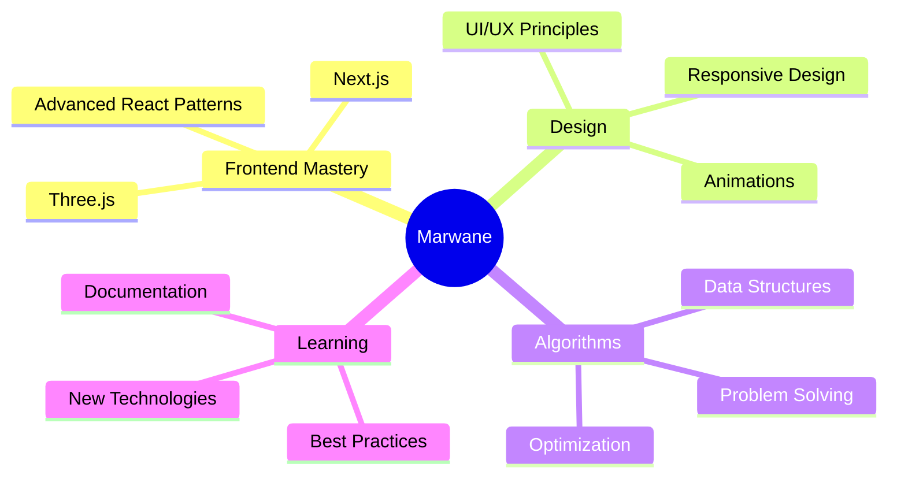

<div align="center">

# 👋 Hey, I'm Marwane Traiki

### Frontend Developer | UI/UX Enthusiast | Algorithm Lover


[](https://www.linkedin.com/in/marwan-traiki-59a00a256)
[](mailto:marwantraiki@gmail.com)

</div>

---

## 🚀 About Me

```javascript
const marwane = {
    location: "Morocco 🇲🇦",
    currentFocus: ["Next.js", "Three.js", "Advanced Animations"],
    expertise: ["React", "JavaScript", "TailwindCSS"],
    philosophy: "The more I learn, the less I code - because quality > quantity",
    passion: "Algorithms and the beautiful headache of persistence",
    status: "Just let me learn in peace 🧠"
};
```


### 💡 What I'm Up To

- 🎯 Diving deep into **Next.js** and **Three.js**
- 🎨 Creating pixel-perfect, responsive interfaces
- 🧩 Solving algorithmic challenges
- 📚 Learning something new every single day
- ✨ Building projects that make a difference

### 💬 Let's Talk About

**React** • **JavaScript** • **TailwindCSS** • **Frontend Architecture** • **UI/UX Design** • **Web Performance**

---

## 🛠️ Tech Arsenal

<div align="center">

### Frontend & Design


### Backend & Database


### Programming Languages


### Tools & DevOps


</div>

---

## 📊 GitHub Stats

<div align="center">
  


</div>

---

## 🎯 Current Focus



---

## 🌟 Featured Projects

<div align="center">

<!-- Add your best projects here when you have them -->
<!-- Example format:
[](link)
**Brief description of what it does**
-->

Coming soon... Building something amazing! 🚀

</div>

---

## 💭 Philosophy

> *"The more I learn, the less I code - because understanding beats rushing."*

> *"Algorithms give me headaches, persistence gives me solutions."*

> *"Just let me learn in peace - the code will follow."*

---

<div align="center">

### 📫 Let's Connect!

**Open to collaborations, interesting projects, and great conversations!**

[](https://www.linkedin.com/in/marwan-traiki-59a00a256)
[](mailto:marwantraiki@gmail.com)

---


**⭐️ From [Marwane Traiki](https://github.com/YOUR_GITHUB_USERNAME)**

</div>
